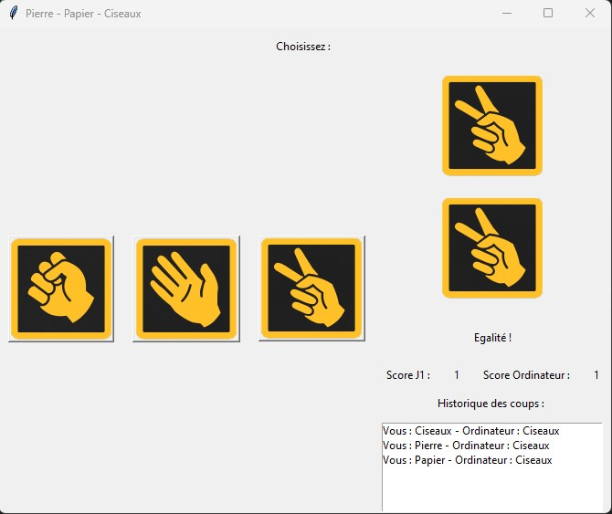
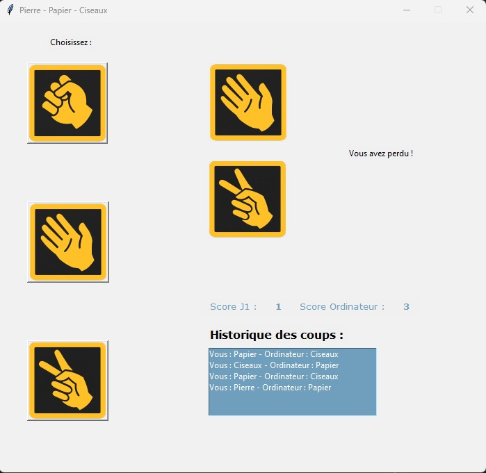

# Jeu pierre papier ciseaux

* Utilisation de Tkinter sur Python
* Jeu entre un utilisateur et un ordinateur
* If... else, image, widgets, fonctions, labels, frames
* Historique des coups joués

## Énoncé de l'exercice

* Créer un jeu simple où l'utilisateur peut choisir pierre, papier ou ciseaux et jouer contre l'ordinateur.
* Afficher le score et l'historique des coups

## Visuel v1

## Amélioration du visuel

* Mis en place de chaque élément avec ``.place`` au lieu de ``.pack``
* Mise en forme du texte et de la Listbox